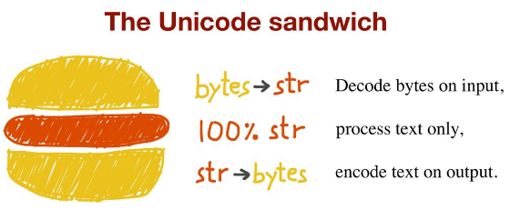

# bytes, str, unicode의 차이점을 알자

파이썬에서 문자열은 크게 아래와 같이 나눌 수 있다.

-|__phthon2__ |__python3__
-------------|--------|--------
__8bit 값__  |str     |bytes
__유니코드__  |unicode |str

유니코드 값을 나타내기 위해서는 코드 포인트를 사용하는데 0 ~ 1,114,111 범위의 숫자이며 유니코드 표준에서는 U+ 접두사를 붙여서 4~6 자리 사이의 16진수로 표현한다.

문자를 표현하는 실제 바이트는 사용하는 __인코딩__에 따라 달라진다. A 문자 ( U+0041 )에 대한 예는 아래와 같다.

인코딩 방식|바이트 형태|
----------|---------|
UTF-8     |0x41
UTF-16LE  |0x4100

코드 포인트를 바이트로 변환하는 것을 __인코딩__ 바이트를 코드 포인트로 변환하는 것을 __디코딩__이라고 한다.

이처럼 문자열을 표현하는 방식은 다양한데 파이썬에서 문자열을 효율적으로 처리하는 최고의 방법은 유니코드 샌드위치이다.



유니코드 샌드위치란 아래와 같은 방식으로 문자열을 다루는 것을 의미한다.

1. 입력 시 byte를 디코딩한다.
2. 문자열을 텍스트로만 처리한다.
3. 출력 시 str을 인코딩한다.

즉 문자열을 효율적으로 처리하기 위해서는 8bit 값을 유니코드로 변환하거나 유니코드를 8bit 값으로 변환해야 한다.

유니코드나 8bit 값을 입력받고 유니코드를 반환하는 함수를 버전 별로 살펴보면 아래와 같다.
* python3
```py
def to_str(bytes_or_str):
    if isinstance(bytes_or_str, bytes):
        value = bytes_or_str.decode('utf-8')
    else:
        value = bytes_or_str
    return value
```

* python2
```py
def to_unicode(unicode_or_str):
    if isinstance(unicode_or_str, str):
        value = unicode_or_str.decode('utf-8')
    else:
        value = unicode_or_str
    return value
```

유니코드나 8bit 값을 입력받고 8bit 값을 반환하는 함수를 버전 별로 살펴보면 아래와 같다.
* python3
```py
def to_bytes(bytes_or_str):
    if isinstance(bytes_or_str, str):
        value = bytes_or_str.encode('utf-8')
    else:
        value = bytes_or_str
    return value
```

* python2
```py
def to_str(unicode_or_str):
    if isinstance(unicode_or_str, unicode):
        value = unicode_or_str.encode('utf-8')
    else:
        value = unicode_or_str
    return value
```

python3에서는 문자열을 파일에서 읽어오거나 쓸 때 인코딩을 지정할 수 있다.
```py
with open('test.txt', 'w', encoding='ansi') as f:
    f.write(os.urandom(10))

with open('test.txt', 'r', encoding='ansi') as f:
    print(f.read())
```

python2에서는 파일을 다룰 때 기본적으로 바이너리 인코딩을 사용하였으나. python3에서는 encoding 인수가 추가되어 인코딩을 지정할 수 있게 되었다.
encoding 인수의 기본값은 시스템 기본 인코딩을 따르게 되는데 이로 인해서 플랫폼에 따라 혹은 지역 설정에 따라 다른 바이트를 담은 파일을 생성하게 되어 호환성 문제를 일으킨다.
```py
with open('test.txt', 'w', encoding='utf-8') as f:
    f.write('파이썬 코딩의 기술')

with open('test.txt', 'r') as f:
    print(f.read())              #호출시 에러

#에러를 확인해보면 cp949로 디코딩 할 수 없는 문자가 있는걸 알 수 있다. 한글 윈도우의 기본 인코딩이 cp949인 것을 알 수 있다.
Traceback (most recent call last):
  File "C:/Users/xtozero/Documents/Effective Python/SampleCode/ch03.py", line 28, in <module>
    print(f.read())
UnicodeDecodeError: 'cp949' codec can't decode byte 0xed in position 0: illegal multibyte sequence
```

또한 python3의 open은 유니코드 문자를 담은 str인스턴스를 기대하기 때문에 바이너리 파일을 다루려면 바이너리 모드로 파일을 열어야 한다.
```py
with open('binary.txt', 'wb') as f:
    f.write(os.urandom(10))
```

python2에서는 str이 7bit 아스키 문자만 포함하고 있다면 unicode와 str이 같은 타입처럼 보인다.
하지만 python3에서는 bytes와 str은 빈 문자열이라도 절대 같지 않다.
> python공식 문서에서는 str 코드 포인트를 메모리에 저장하는 문제에 대한 언급을 피하고 있다.
다만 메모리 안에서 모든 문자와 슬라이스에 효율적으로 접근할 수 있도록 ptyhon3는 str을 코드 포인트마다 고정된 수의 바이트를 이용해서 저장한다.
python 3.3 이전에는 2byte 나 4byte 중 하나를 사용할 수 있도록 컴파일할 수 있었다.
python 3.3 이후에는 str객체를 생성할 때 효율적인 메모리 구조를 조사하여 1byte, 2byte, 4byte 구조 중 하나를 사용한다.

## 정리
* python3에서 bytes는 8bit, str은 유니코드 문자를 저장한다.
* python2에서 str은 8bit, unicode는 유니코드 문자를 저장한다.
* 문자열을 처리할 때는 유니코드 샌드위치를 이용해서 문자열을 다뤄야 한다.
* 바이너리 데이터를 파일에서 읽거나 쓸 때는 파일을 바이너리 모드로 열어야 한다.
