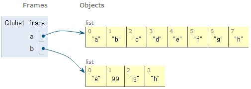
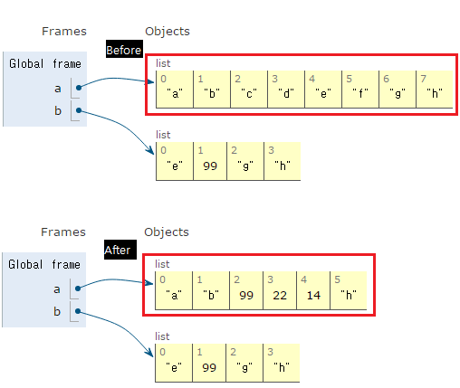

# 시퀸스를 슬라이스하는 방법을 알자

파이썬은 시퀀스를 조각으로 만드는 문법을 제공한다. list, str, bytes등 모든 시퀀스 형은 슬라이스가 가능하며 슬라이스는 결국 sequence.\_\_getitem\_\_(slice(start, end, stride))를 호출하므로 특수 메서드 \_\_getitem\_\_ 과 \_\_setitem\_\_ 를 구현한 파이썬 클래스도 슬라이스가 가능하다.

슬라이스 문법의 기본 형태는 sequence[start : end : stride]이며 start 인덱스는 포함되고 end 인덱스는 제외된다.
> 즉 [start,end)의 범위를 갖는데 end를 포함하지 않음으로써 슬라이스할 범위의 길이를 쉽게 계산할 수 있다.

```py
a = ['a', 'b', 'c', 'd', 'e', 'f', 'g', 'h']
print('First four', a[:4])
print('Last four', a[-4:])
print('Middle four', a[3:-3])

>>>
First four ['a', 'b', 'c', 'd']
Last four ['e', 'f', 'g', 'h']
Middle four ['d', 'e']
```

시퀀스의 처음부터 슬라이스하거나, 리스트의 끝까지 슬라이스할 때는 인덱스를 생략할 수 있다.
```py
assert a[:5] == a[0:5]
assert a[0:] == a[0:len(a)]
```

시퀀스의 끝을 기준으로 오프셋을 계산할 때는 음수로 슬라이스를 할 수 있다.
```py
print(a[:])
print(a[:5])
print(a[:-1])
print(a[4:])
print(a[-3:])
print(a[2:5])
print(a[2:-1])
print(a[-3:-1])

>>>
['a', 'b', 'c', 'd', 'e', 'f', 'g', 'h']
['a', 'b', 'c', 'd', 'e']
['a', 'b', 'c', 'd', 'e', 'f', 'g']
['e', 'f', 'g', 'h']
['f', 'g', 'h']
['c', 'd', 'e']
['c', 'd', 'e', 'f', 'g']
['f', 'g']
```

start 인덱스와 end 인덱스가 시퀀스의 경계를 벗어나도 적절하게 슬라이스 된다.
```py
first_twenty_items = a[:20]
last_twenty_items = a[-20:]
print(first_twenty_items)
print(last_twenty_items)

>>>
['a', 'b', 'c', 'd', 'e', 'f', 'g', 'h']
['a', 'b', 'c', 'd', 'e', 'f', 'g', 'h']
```
> 시퀀스의 인덱스를 음수 변수로 지정하면 뜻밖의 결과를 얻게 되는 상황이 존재하니 주의해야 한다. 만약 sequence[-n:]이라는 구문에서 n이 0이면 원본 리스트의 복사본이 만들어지게 된다.

슬라이스 한 결과는 새로운 시퀀스이다. 원본 시퀀스에 들어있는 객체에 대한 참조는 유지되지만 슬라이스 한 결과를 수정해도 원본 시퀀스에는 영향이 없다.
```py
b = a[4:]
print('Before   ', b)
b[1] = 99
print('After    ', b)
print('No change', a)

>>>
Before    ['e', 'f', 'g', 'h']
After     ['e', 99, 'g', 'h']
No change ['a', 'b', 'c', 'd', 'e', 'f', 'g', 'h']
```
위의 코드를 그림으로 보면 아래와 같다.



따라서 시작과 끝 인덱스를 모두 생략하고 슬라이스하면 원본 리스트의 복사본을 얻을 수 있다.
```py
b = a[:]
assert b == a and b is not a
```

슬라이스를 할당에 사용하면 원본 리스트에서 지정한 범위를 대체한다. 할당 결과 시퀀스는 새로 들어온 값에 맞춰 늘어나거나 줄어든다.
```py
print('Before   ', a)
a[2:7] = [99, 22, 14]
print('After    ', a)

>>>
Before    ['a', 'b', 'c', 'd', 'e', 'f', 'g', 'h']
After     ['a', 'b', 99, 22, 14, 'h']
```


따라서 슬라이스에 시작과 끝 인덱스를 지정하지 않고 할당하면 슬라이스의 전체 내용을 참조 대상의 복사본으로 대체한다.
```py
b = a
print('Before', a)
a[:] = [101, 102, 103]
assert a is b
print('After', a)

Before ['a', 'b', 99, 22, 14, 'h']
After [101, 102, 103]
```

## 정리
* 슬라이싱을 할 때 start 인덱스에 0을 설정하거나 end 인덱스에 시퀀스 길이를 설정하지 말자
* 슬라이싱은 범위를 벗어난 인덱스도 적절히 처리해 준다.
* 시퀀스 슬라이스에 할당하면 원본 시퀀스에 지정한 범위를 참조 대상의 내용으로 대체한다.
