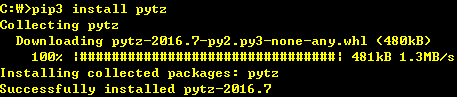

# 커뮤니티에서 만든 모듈을 어디서 찾아야 하는지 알아두자

파이썬은 프로그램에서 사용할 수 있는 모듈들의 중앙저장소(http://pypi.python.org)를 제공하고 있다.  
파이썬 커뮤니티에서 이러한 모듈을 제작하고 관리하며 이런 커뮤니티가 익숙하지 않으면 PyPI(Python Package Index)가 원하는 목적에 가까운 코드를 찾을 수 있도록 도와준다.  

PyPI는 명령줄 도구 pip를 통해서 사용한다. pip는 파이썬 3.4 이후 버전에 기본적으로 설치되어 있다.
> python -m pip 명령을 입력하면 접근할 수 있다.

파이썬 3.4 이전 버전에서는 http://packaging.python.org 에서 pip를 설치할 수 있다.  
pip를 통해서 새 모듈을 설치하는 방법은 간단하다. 예를 들어 pytz모듈을 다음과 같이 설치할 수 있다.  

패키지의 파이썬 3 버전을 설치하려면 __pip3__ 명령을 사용하고 파이썬 2 버전의 패키지를 설치하려면 __pip__ 명령어를 사용하면 된다.  
인기 있는 패키지는 대부분 파이썬 2와 3을 모두 지원한다.  
또한 pip를 pyenv와 사용하면 프로젝트에 설치할 패키지 집합을 추적할 수 있다. ([Ch53 참고](../Ch53))

## 정리
1. PyPI는 파이썬 커뮤니티에서 제작하고 유지하는 풍부한 공통 패키지를 포함하고 있다.
2. pip 명령줄 도구를 사용하여 패키지를 손쉽게 설치할 수 있다.
3. pip 는 파이썬 3.4 이후부터 자동 설치되며 이전 버전은 따로 설치해야 한다.
